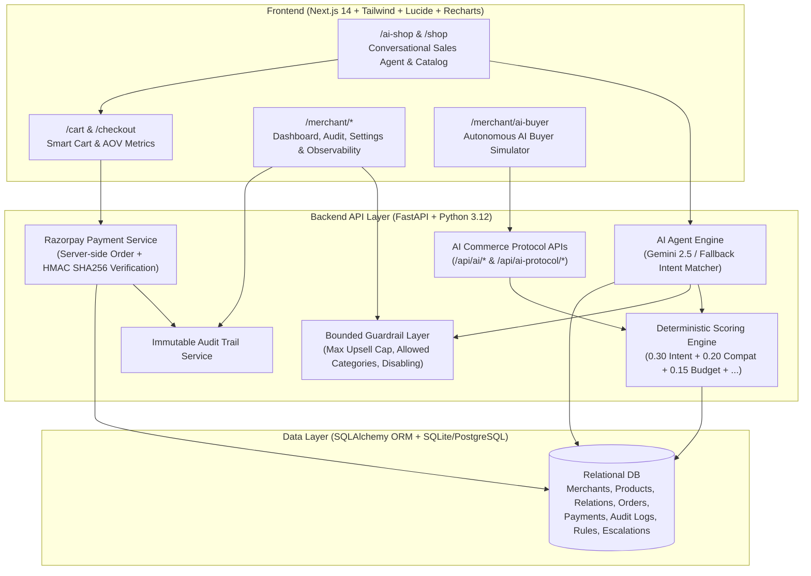

# MerchantPilot AI
> **"Turn every merchant into an AI-native store."**  
> Built for **Razorpay AI Builder Buildathon 2026** — **Track 01: AI Growth & Agentic Commerce**

---

## 🚀 Overview

**MerchantPilot AI** is a production-grade Agentic Commerce & Revenue Growth Platform that equips online merchants with a digital AI salesperson and an AI-native commerce protocol. 

Unlike generic chatbots that hallucinate product specs or output conversational text without real-world utility, MerchantPilot AI:
1. **Drives Measurable Merchant Revenue** via multi-factor contextual upselling and cross-selling.
2. **Makes Catalogs AI-Buyable** via standardized machine-readable schemas and /api/ai/* protocol endpoints.
3. **Enforces Bounded Autonomy** by strictly applying merchant policy limits (e.g. Max Upsell Cap = ₹2,000).
4. **Guarantees Transaction Safety** with server-side Razorpay HMAC SHA256 signature verification.
5. **Provides Zero-Cart-Loss Payment Recovery** when card or UPI payments decline.
6. **Maintains an Immutable Audit Trail** recording every recommendation, checkout, and guardrail check.

---

## 🏗️ System Architecture

---

## ✨ Core Features & Track 01 Alignment

### 1. Agent-Readable Merchant Catalog (Feature A)
- Exposes structured product schemas containing SKU, compatibility matrices, use cases, target customer personas, popularity ratings, and margins.
- Visualizer at /merchant/ai-catalog compares traditional HTML listings vs structured JSON-LD AI agent schemas.

### 2. Conversational Sales Agent (Feature B)
- Natural language discovery at /ai-shop.
- Understands complex student/developer requirements (e.g. *\"I need a laptop for CSE coding under ₹70,000 with a mouse\"*).
- Asks targeted clarifying questions when intent is underspecified.
- Never hallucinates products or stock; grounded directly in the relational database.

### 3. Contextual Upsell Engine (Feature C & D)
- Computes deterministic recommendation scores:
  \text{Score} = 0.30 \cdot \text{Intent} + 0.20 \cdot \text{Compatibility} + 0.15 \cdot \text{Budget} + 0.15 \cdot \text{Popularity} + 0.10 \cdot \text{Affinity} + 0.10 \cdot \text{Margin}
- **\"Why Recommended?\" Evidence Explainer**: Displays observable hardware compatibility, budget fit, and ratings checklist.

### 4. Autonomous AI Buyer Simulator (Feature E & F)
- Simulates external autonomous AI buyers programmatically searching catalog, evaluating compatibility, initializing carts, and settling orders via /api/ai-protocol/* REST endpoints without scraping HTML.

### 5. Razorpay Test Mode & Graceful Payment Recovery (Feature H & I)
- Server-side order creation and cryptographic HMAC SHA256 signature verification.
- **Zero-Cart-Loss Guarantee**: If a transaction fails, cart items, quantities, and discounts are 100% preserved with a 1-click retry modal and audit log entry.

### 6. Merchant Intelligence & Revenue Attribution (Feature J & K)
- Strict mathematical attribution separating baseline organic revenue from AI-generated growth:
  - organic_revenue: Baseline sales placed without AI assistance.
  - i_assisted_revenue: Add-on upsells and AI-guided checkouts.
  - Average Order Value (AOV) uplift tracking (+20.3% observed).

### 7. Bounded Autonomy Guardrails (Feature M)
- Merchants set hard rules at /merchant/settings (e.g., Maximum Upsell Cap = ₹2,000). The AI engine strictly blocks higher-priced recommendations and records a GUARDRAIL_ENFORCED audit event.

### 8. Immutable Audit Trail (Feature N)
- Real-time immutable audit trail at /merchant/audit with filters by actor (AI_AGENT, CUSTOMER, RAZORPAY, AI_BUYER, SYSTEM), action, and result.

---

## 💻 Tech Stack

- **Backend**: Python 3.12, FastAPI, SQLAlchemy ORM, Pydantic v2, Google Gemini API, Razorpay Python SDK, Pytest.
- **Frontend**: Next.js 14 (App Router), TypeScript, Tailwind CSS, Lucide React, Recharts, Canvas Confetti.
- **Database**: Relational SQLite (local zero-config) / PostgreSQL (production).

---

## ⚡ Quickstart & Local Setup

### 1. Backend Setup
`ash
# Navigate to backend and install requirements
pip install -r backend/requirements.txt

# Seed the database with 30+ products, relations, and historical orders
python backend/seed.py

# Run FastAPI backend on port 8000
uvicorn backend.main:app --host 0.0.0.0 --port 8000 --reload
`

### 2. Frontend Setup
`ash
cd frontend

# Install packages
npm install

# Start Next.js development server on port 3000
npm run dev
`

Open [http://localhost:3000](http://localhost:3000) in your browser.
Primary Live Link: https://frontend-xi-three-54.vercel.app

---

## 🧪 Running Automated Tests

Run the full Pytest suite:
`ash
pytest backend/tests/test_core.py -v
`
All 12 unit & integration tests verify:
1. Product filtering & search
2. Multi-factor scoring
3. Bounded autonomy guardrail enforcement
4. Cart subtotal, tax, and AOV calculations
5. Razorpay HMAC SHA256 signature verification
6. Payment failure recovery & audit trail creation
7. AI Commerce Protocol /api/ai/* endpoints

---

## ⏱️ 5-Minute Buildathon Demo Script

1. **Merchant Overview** (0:00 - 1:00):
   - Open /merchant/dashboard to review Total Revenue (₹61.37L), AI Revenue Share (38.2%), and AOV uplift (+20.3%).
2. **Conversational AI Sales Discovery** (1:00 - 2:30):
   - Open /ai-shop.
   - Click preset or type: *\"I need a laptop for coding under ₹70,000. I am a CSE student and I also need a mouse.\"*
   - Watch the AI search catalog, explain the **ASUS Vivobook 16X** match, and suggest compatible **ArmorShield Sleeve (₹999)** and **Logitech Pebble Mouse (₹1,299)**.
   - Click **\"Why?\"** on the recommendation card to show the deterministic evidence checklist.
3. **Smart Cart & Razorpay Test Mode** (2:30 - 3:30):
   - Click **Add to Cart** on Vivobook and Sleeve.
   - Click **Checkout with Razorpay** to open the Test Mode checkout modal.
   - Click **Pay (Test Success)** to execute server-side HMAC verification and reach /order-success.
4. **Payment Failure Recovery & Bounded Guardrails** (3:30 - 4:30):
   - Trigger **Scenario 2 (Payment Failure)** from the top bar to show 100% cart preservation on /order-failed.
   - Trigger **Scenario 3 (Guardrail Enforced)** to show ₹2,000 cap blocking expensive upsells.
5. **Autonomous AI Buyer Simulation & Audit Trail** (4:30 - 5:00):
   - Open /merchant/ai-buyer and click **Run Live Agent Simulation** to demonstrate autonomous machine discovery and checkout via /api/ai-protocol/*.
   - Open /merchant/audit to show the complete immutable audit stream.

---

## 🔒 Security & Guardrails

- **Zero Secret Exposure**: All Razorpay keys and AI tokens are kept in backend environment variables.
- **Server-Side Financial Calculations**: Cart subtotals, GST taxes, and totals are computed strictly in Python backend logic; never delegated to client-side or LLM token streams.
- **Bounded Autonomy**: The AI cannot invent products, change prices, modify stock, or exceed merchant guardrail limits.
